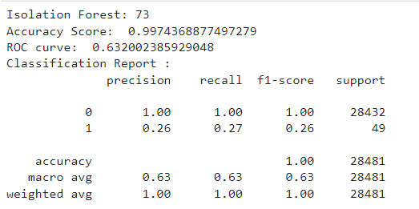

## Isolation Forests

Isolation Forest is an unsupervised machine learning algorithm which is used for anomaly detection (e.g., credit card fraud / money laundering). Isolation forests are similar to random forests in the sense that they both use an ensemble of trees for classification. Instead of decision trees, isolation forests use what are called isolation trees. Once the isolation forest is built, the anomalies are points with the shortest average path length. In isolation forests, it's much easier to isolate an outlier than it is to isolate in inlier (or "normal" points).

## What are isolation trees and how do they work?


Isolation trees are data structures with the following property:

Let T be a node of an isolation tree. For each node in the tree, it's either an external node (single node with no children) or an internal node with 2 daughter nodes ($T_l$, $T_r$) with a "test". On a diagram, $T_l$ and $T_r$ would represent the left and right daughter nodes, respectively.

$\textbf{What’s the “test” in an isolation tree?}$

Given a sample of data $X = \{x_1,x_2,..., x_n\}$ with n observations from a d-variate distribution an isolation tree would take an attribute $q$of an observation and compare it to a splitting value p. The test is $q < p$: if $q < p$, then the point would be assigned to $T_l$, else it would be assigned to $T_r$. To build an isolation tree, we recursively divide X by randomly selecting an attribute $q \in\{1,...,d\}$ and splitting value $p$, which is some number in between the maximum and minimum of the $q$th attribute of all data points. The test splits the data points into $T_l$ and $T_r$ and the process continues recursively until either:

$\quad$ a) A height limit is reached

$\quad$ b) \|X\| = 1 (can't split data anymore)

$\quad$ c) Or all data in X have the same value


Once the splitting process is over, we're left with an isolation tree. We then have to tell which points are anomalies and which are "normal" points, which is done by sorting them by their path length and anomaly score.

## Path Length and Anomaly Score

Path length $h(x)$: is measured by the number of edges $x$, a data point, traverses an isolation tree from the root node to an external node.

The anomaly score s of an instance $x$ is defined as: $s(x,n) = 2^{-E(h(x)/c(n))}$, where $E(h(x))$ is the expected $h(x)$ from a collection of isolation trees, $c(n) = 2H(n − 1) − (2(n − 1)/n)$; average path length of unsuccessful search in Binary Search Tree, $H(i)$ is the harmonic number and it can be estimated by $ln(i) + 0.5772156649$ (Euler's constant).More about why $c(n)$ is used in references.

Looking at anomaly score we see that:

As $E(h(x)) \rightarrow c(n), s \rightarrow 0.5$

As $E(h(x)) \rightarrow 0, s \rightarrow 1$

As $E(h(x)) \rightarrow n-1, s \rightarrow 0$

Most notably, this implies that the lower the average path length of a point (i.e., more likely to be an anomaly), the higher the anomaly score. Conversely, the higher the average path length (i.e., more likely to be a normal point), the lower the anomaly score.

## Criteria For Detecting An Anomaly

Using the anomaly score, s, the following assessment is made:

(a) if instances return s very close to 1, then they are definitely anomalies,

(b) if instances have s much smaller than 0.5, then they are quite safe to be regarded as normal instances, and

(c) if all the instances return $s \approx 0.5$, then the entire sample does not really have any distinct anomaly.

## To implement isolation forests (in Python) algorithmically, one can control:

n_estimators: The number of base estimators (isolation trees) in ensemble (forest)

max_samples: The number of samples to draw from the dataset to train each base estimator.

contamination: The proportion of outliers in the dataset

bootstrap: If True, individual trees are fit on random subsets of the training data sampled with replacement.

## To Implement isolation forest (in R) algorithmically, one can control:

ntrees: The number of isolation trees in isolation forest

sample_size: The number of samples to draw from the dataset to train each isolation tree.

ndim: The number of columns to combine to produce a split

missing_action: How to handle missing data at both fitting and prediction time. Set equal to "fail" will assume there's no missing data and will trigger undefined behavior if it encounters any

scoring_metric: Metric to use for determining anomaly scores

prob_pick_pooled_gain: indicates the probability of choosing the threshold on which to split a variable (with ndim = 1).

```{r setup, include=FALSE}
knitr::opts_chunk$set(echo = TRUE)

# load packages and data
require(tidyverse)
require(isotree)
require(mlbench)
require(MLmetrics)
require(kableExtra)
require(ggplot2)
require(dplyr)
require(yardstick)

load("data/creditcard.RData")
# iForest is an unsupervised algorithm, so we remove the labels
# from these data
class <- credit %>% select(Class)
credit <- credit %>% select(-Class)
```

# R Implemenation

Isolation forests are a method of anomaly and outlier detection. We chose a dataset of credit card transactions, as it is useful to identify such anomalies.

First, we plot the data of the time and amount of credit card transactions. The data are from <https://www.kaggle.com/datasets/mlg-ulb/creditcardfraud>.

```{r}
# plot data
ggplot(credit, aes(x = Time, y = Amount)) +
  geom_point(shape = 1, alpha = 0.5) +
  labs(x = "Time", y = "Transaction Amount") +
  labs(alpha = "", color = "Legend")
```

Then, using the `isotree` package, we create a new isolation forest with default parameters and fit it to the data.

```{r, eval = FALSE}
# create an iForest with default parameters
model_orig <- isolation.forest(
  credit,
  ndim = 1,
  sample_size = 256,
  ntrees = 1000,
  missing_action = "fail"
)
# make predictions using the iForest model
pred_orig <- predict(model_orig, credit)
```

Next, we play around with the parameters to make two other types of iForests, known as a Density iForest and a Fair-Cut iForest.

```{r, eval = FALSE}
# density iForest
model_dens <- isolation.forest(
  credit,
  ndim = 1,
  sample_size = 256,
  ntrees = 1000,
  missing_action = "fail",
  scoring_metric = "density"
)
# density iForest predictions
pred_dens <- predict(model_dens, credit)

# fair-cut iForest
model_fcf <- isolation.forest(
  credit,
  ndim = 1,
  sample_size = 32,
  prob_pick_pooled_gain = 1,
  ntrees = 1000,
  missing_action = "fail"
)
# fair-cut iForest predictions
pred_fcf <- predict(model_fcf)
```

In the case of anomalies, our metric of choice is going to be the area under the curve. Accuracy is not the best metric in this case since there are few outliers and classifying the entire dataset as normal points would still yield a high accuracy rate. The ROC curve on the other hand, finds a balance between sensitivity (true positives) and specificity (false positives) giving us better insight into how well our models worked. We compare the models below, with the default iForest performing the best according to the AUROC metric.

```{r, eval = FALSE}
# store AUC measurements for each model type
results_df <- data.frame(
  Model = c(
    "Isolation Forest",
    "Density Isolation Forest",
    "Fair-Cut Forest"
  ),
  AUROC = c(
    AUC(pred_orig, class),
    AUC(pred_dens, class),
    AUC(pred_fcf, class)
  )
)
# display
results_df %>%
  kable() %>%
  kable_styling()
```


Lastly, a new plot of the data on a gradient from least likely to be an outlier (yellow) to most likely to be an outlier (purple).

```{r, eval = FALSE}
# outlier plot
ggplot(credit, aes(x = Time, y = Amount, color = pred_orig)) +
  geom_point(alpha = 0.5, fill = pred_orig) +
  labs(x = "Time", y = "Transaction Amount") +
  labs(alpha = "", color = "Legend") +
  scale_color_gradient(low = "yellow", high = "purple")
```


We followed the guide in the following link: <https://www.kaggle.com/code/norealityshows/outlier-detection-with-isolation-forest-in-r/notebook>

# Python Implementation

The python implementation will use the IsolationForest function from sklearn and the same credit card dataset as the R implementation.

```{python}
# imports
from sklearn.ensemble import IsolationForest
import matplotlib.pyplot as plt
import pandas as pd
import numpy as np
from sklearn.metrics import classification_report,accuracy_score,roc_auc_score

```

### Reading the credit card dataset

This dataset has 31 variables:

-   Time - time of transaction

-   V1-28 - PCAs

-   Amount - amount of money in transaction

-   Class - 0 or 1, where 0 is not a fraud and 1 is a fraud

```{python}
# reading data
data = pd.read_csv('data/creditcard.csv')
data.head()
```

Determine the number of fraud and valid transactions in the entire dataset.

Notice that there are significantly more normal transactions than fraud transactions. The fraud transactions are the anomolies, which is what we are trying to detect.

```{python}
count_classes = pd.value_counts(data['Class'], sort = True)
count_classes.plot(kind = 'bar', rot=0)
plt.title("Transaction Class Distribution")
plt.xticks(range(2), ["Normal", "Fraud"])
plt.xlabel("Class")
plt.ylabel("Frequency")
```


Use binary classification to break transactions into two groups. Any observation with class 0 is considered normal and any observation with class 1 is considered fraud.

```{python}
#Assigning the transaction class "0 = NORMAL  & 1 = FRAUD"
Normal = data[data['Class']==0]
Fraud = data[data['Class']==1]
```

Partitioning the dataset

-   X is all columns except the class column

-   Y is the class column which will be used as the predictor

```{python}
# Take a sample from the data
data1= data.sample(frac = 0.1,random_state=1)
data1.shape
# Get all the columns from the dataframe
columns = data1.columns.tolist()
# Filter the columns to remove data we do not want 
columns = [c for c in columns if c not in ["Class"]]
# Store the variable we are predicting 
target = "Class"
# Define a random state 
state = np.random.RandomState(42)
X = data1[columns]
Y = data1[target]
X_outliers = state.uniform(low=0, high=1, size=(X.shape[0], X.shape[1]))
```

### Isolation Forest

Now we will define our isolation forest model. The main idea of isolation forest is to use trees to essentially "isolate" anomolies. Anomolies should not take many trees to be isolated from the rest of the dataset. This isolation forest model is taken from sklearn. The following parameters are:

-   n_estimators : the number of base estimators in ensemble

-   max_samples: number of samples to draw from X to train eachbase estimator

-   contamination: proportion of outliers in dataset

-   random_state: controls pseudo-randomness of selection of feature and split values

-   verbose: controls verbosity of tree building process

```{python}
# isolation forest
Fraud = data1[data1['Class']==1]
Valid = data1[data1['Class']==0]
outlier_fraction = len(Fraud)/float(len(Valid))
iforest = IsolationForest(n_estimators=100, max_samples=len(X), contamination=outlier_fraction,random_state=state, verbose=0)
```

```{python}
# Isolation forest model
n_outliers = len(Fraud)
iforest.fit(X)
scores_prediction = iforest.decision_function(X)
y_pred = iforest.predict(X)
```

```{python}
# reshape the prediction to 0 and 1
y_pred[y_pred == 1] = 0
y_pred[y_pred == -1] = 1
n_errors = (y_pred != Y).sum()
```

```{python}
# accuracy report
print("Isolation Forest:", n_errors)
print("Accuracy Score: ", accuracy_score(Y, y_pred))
print("ROC curve: ", roc_auc_score(Y, y_pred))
print("Classification Report :")
print(classification_report(Y,y_pred
))
```



We followed the guide using the following link: <https://www.kaggle.com/code/naveengowda16/anomaly-detection-credit-card-fraud-analysis>
