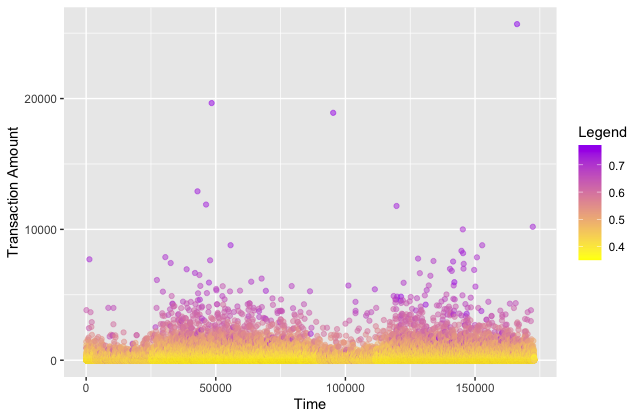

```{r setup, include=FALSE}
knitr::opts_chunk$set(echo = TRUE)

# load packages and data
require(tidyverse)
require(isotree)
require(mlbench)
require(MLmetrics)
require(kableExtra)
require(ggplot2)
require(dplyr)
require(yardstick)

load("data/creditcard.RData")
# iForest is an unsupervised algorithm, so we remove the labels
# from these data
class <- credit %>% select(Class)
credit <- credit %>% select(-Class)
```

Isolation forests are a method of anomaly and outlier detection. We choose a dataset of credit card transactions, as it is useful to identify such anomalies.

First, we plot the data of the time and amount of credit card transactions. The data are from <https://www.kaggle.com/datasets/mlg-ulb/creditcardfraud>.

```{r}
# plot data
ggplot(credit, aes(x = Time, y = Amount)) +
  geom_point(shape = 1, alpha = 0.5) +
  labs(x = "Time", y = "Transaction Amount") +
  labs(alpha = "", color = "Legend")
```

Then, using the `isotree` package, we create a new isolation forest with default parameters and fit it to the data.

```{r, eval = FALSE}
# create an iForest with default parameters
model_orig <- isolation.forest(
  credit,
  ndim = 1,
  sample_size = 256,
  ntrees = 1000,
  missing_action = "fail"
)
# make predictions using the iForest model
pred_orig <- predict(model_orig, credit)
```

Next, we play around with the parameters to make two other types of iForests, known as a Density iForest and a Fair-Cut iForest.

```{r, eval = FALSE}
# density iForest
model_dens <- isolation.forest(
  credit,
  ndim = 1,
  sample_size = 256,
  ntrees = 1000,
  missing_action = "fail",
  scoring_metric = "density"
)
# density iForest predictions
pred_dens <- predict(model_dens, credit)

# fair-cut iForest
model_fcf <- isolation.forest(
  credit,
  ndim = 1,
  sample_size = 32,
  prob_pick_pooled_gain = 1,
  ntrees = 1000,
  missing_action = "fail"
)
# fair-cut iForest predictions
pred_fcf <- predict(model_fcf)
```

In the case of anomalies, our metric of choice is going to be the area under the curve. Accuracy is not the best metric in this case since there are few outliers and classifying the entire dataset as normal points would still yield a high accuracy rate. The ROC curve on the other hand, finds a balance between sensitivity (true positives) and specificity (false positives) giving us better insight into how well our models worked. We compare the models below, with the default iForest performing the best according to the AUROC metric.

```{r, eval = FALSE}
# store AUC measurements for each model type
results_df <- data.frame(
  Model = c(
    "Isolation Forest",
    "Density Isolation Forest",
    "Fair-Cut Forest"
  ),
  AUROC = c(
    AUC(pred_orig, class),
    AUC(pred_dens, class),
    AUC(pred_fcf, class)
  )
)
# display
results_df %>%
  kable() %>%
  kable_styling()
```


Lastly, a new plot of the data on a gradient from least likely to be an outlier (yellow) to most likely to be an outlier (purple).

```{r, eval = FALSE}
# outlier plot
ggplot(credit, aes(x = Time, y = Amount, color = pred_orig)) +
  geom_point(alpha = 0.5, fill = pred_orig) +
  labs(x = "Time", y = "Transaction Amount") +
  labs(alpha = "", color = "Legend") +
  scale_color_gradient(low = "yellow", high = "purple")
```



We followed the guide in the following link: <https://www.kaggle.com/code/norealityshows/outlier-detection-with-isolation-forest-in-r/notebook>
