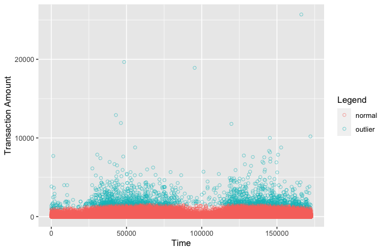

```{r setup, include=FALSE}
knitr::opts_chunk$set(echo = TRUE)

# load packages and data
require(ggplot2)
require(tidyverse)
require(solitude)

load("data/creditcard.RData")
```

Isolation forests are a method of anomaly and outlier detection. We choose a dataset of credit card transactions, as it is useful to identify such anomalies.

First, we plot the data of the time and amount of credit card transactions. The data are from <https://www.kaggle.com/datasets/mlg-ulb/creditcardfraud>.

```{r}
ggplot(credit, aes(x = Time, y = Amount)) +
  geom_point(shape = 1, alpha = 0.5) +
  labs(x = "Time", y = "Transaction Amount") +
  labs(alpha = "", color = "Legend")
```

Then, using the `solitude` package, we create a new isolation forest with default parameters and fit it to the data.

```{r, eval = FALSE}
iforest <- isolationForest$new()

iforest$fit(credit)
```

Next, we use the forest to predict anomalies within the dataset. Our threshold for anomaly detection is 75% likelihood.

```{r, eval = FALSE}
credit$pred <- iforest$predict(credit)
credit$outlier <-
  as.factor(ifelse(credit$pred$anomaly_score >= 0.75, "outlier", "normal"))
```

Lastly, a new plot of the data as outliers or normal.

```{r, eval = FALSE}
ggplot(credit, aes(x = Time, y = Amount, color = outlier)) +
  geom_point(shape = 1, alpha = 0.5) +
  labs(x = "Time", y = "Transaction Amount") +
  labs(alpha = "", color = "Legend")
```



We followed the guide in the following link: <https://www.kaggle.com/code/norealityshows/outlier-detection-with-isolation-forest-in-r/notebook>
